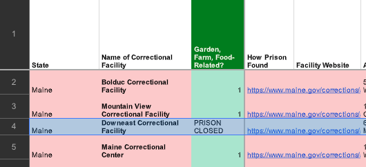
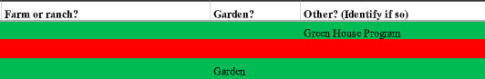
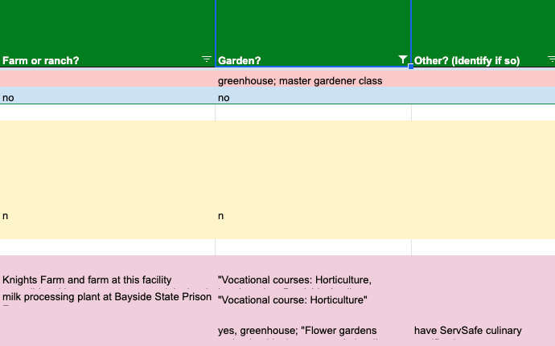
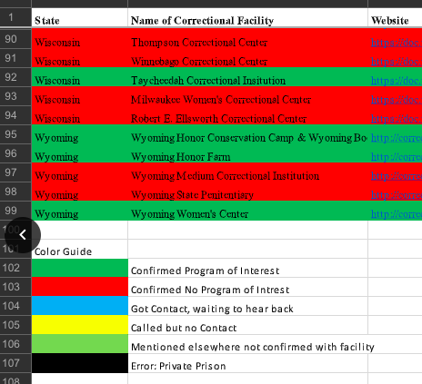

## These slides review how to prepare our correctional facility data for analysis using software. We will discuss:

## Data needs and tasks
- Clean
- Consistent
- Readable

## Locating demographics and facility-level statistics

---

# Data needs

Clean
- no empty rows
- each row is an *open* correctional facility
- each cell must contain only the information intended for that row and column

---
# Data needs

Clean
- outside organizations, e.g. non-profit orgs, should not be entered as a row
- with the exception of Row 1, rows should not be used as section headers or dividers (e.g. a row with only the state name entered as a section divider)
- supplementary information, comments, etc. should only be recorded in the "Notes" column

---

# Tasks

Clean
- delete empty rows and rows that serve as section headers/dividers
- if information recorded in a cell is not intended for that row or column, move info to: the correct row/column, a separate notes document/tab, or delete, as appropriate
- move non-correctional facilities (e.g. non-profit organizations that coordinate food/ag programs) and closed correctional facilities to a separate notes document/tab
- transfer any comments or notes within a column cell to the "Notes" column

---

# Data needs

Consistent
- columns in the same location across all of our spreadsheets, e.g. "Name of correctional facility" should always be in column B
- the same column names
- the same type of information stored in the same column
- the same parsing symbol used between multiple values in the same cell

---

# Data needs

Consistent
- What do you notice about the data entered in each column? 
- Are they the same across both spreadsheets?
- In the second spreadsheet, is the type of information entered in each column similar or different? How?

---

# Tasks

Consistent
- instructions for creating consistent column structures and naming conventions for food/ag program types: https://docs.google.com/document/d/1EhSDo2B-3TM35bRRanrHRSgTYfNmMz638GtOqnaZDNk/
- make sure the spreadsheet column names and ordering are as follows:
State;	Name of Correctional Facility; Confirmed Programs;	Website;	Prison, programing or horticulture contact person(s) (Please identify role);	Email;	Phone;	Date first contact;	Date second contact;	Reply?;	Date of reply;	Farm or ranch?;	Garden or horticulture?;	Other? (Identify if so);	Horticulture;	Crops and silviculture;	Animal agriculture;	Food production;	Culinary arts and food service;	Other; Notes
- for the food/ag program types, use a semi-colon (;) to parse values in cells with multiple values (e.g. greenhouse; master gardener class); this should replace "and", commas (,), and so forth.

---

# Data needs

Readable
- color-coding cannot be read by analytical software
- for color-coded info to be used in analysis, you must convert it to a column, with values corresponding to the color-coded information

---

# Tasks

Readable, e.g.
- ok to keep color-coding (but it will not be read into software)
- move any color-coding keys to another spreadsheet tab entitled "Keys"
- in addition, make sure you have a column entitled "Confirmed Program", inserted after "Name of Correctional Facility"
- Our lab group has decided what values to record in the column "Confirmed Programs": 
1 = confirmed that program(s) are at that facility; 
0 = confirmed that *no* programs are at that facility; and 
null (empty) = unconfirmed / found published info about program but yet to receive official confirmation

---

# Locating facility-level demographics and cost data

- for now, do not worry about recording demographics and facility statistics
- instead, for each state, try to find one or more websites that have demographics and other statistics *at a facility level* and available in tabular formats (e.g. spreadsheets, tables, databases/data files)
- one example is this Colorado website, which contains some cost and population data in tabular formats: https://www.colorado.gov/pacific/cdoc/departmental-reports-and-statistics
- you may already have found this information, and if so, record it in a new tab "Websites" with two columns: state name and website
- this open government data set may be a good starting  place to identify state websites that may contain facility-level data (look in the "SOURCE" column): https://docs.google.com/spreadsheets/d/1xNUqix_mYkXlU0pYdzf1rG5_HQx9UF4ADu-HVsXUHVQ/
- if the data is embedded in non-tabular formats, i.e. in a chart or as text, do not include it

---

class: center, middle

# Thanks!

Slides created via the R package [**xaringan**](https://github.com/yihui/xaringan).
